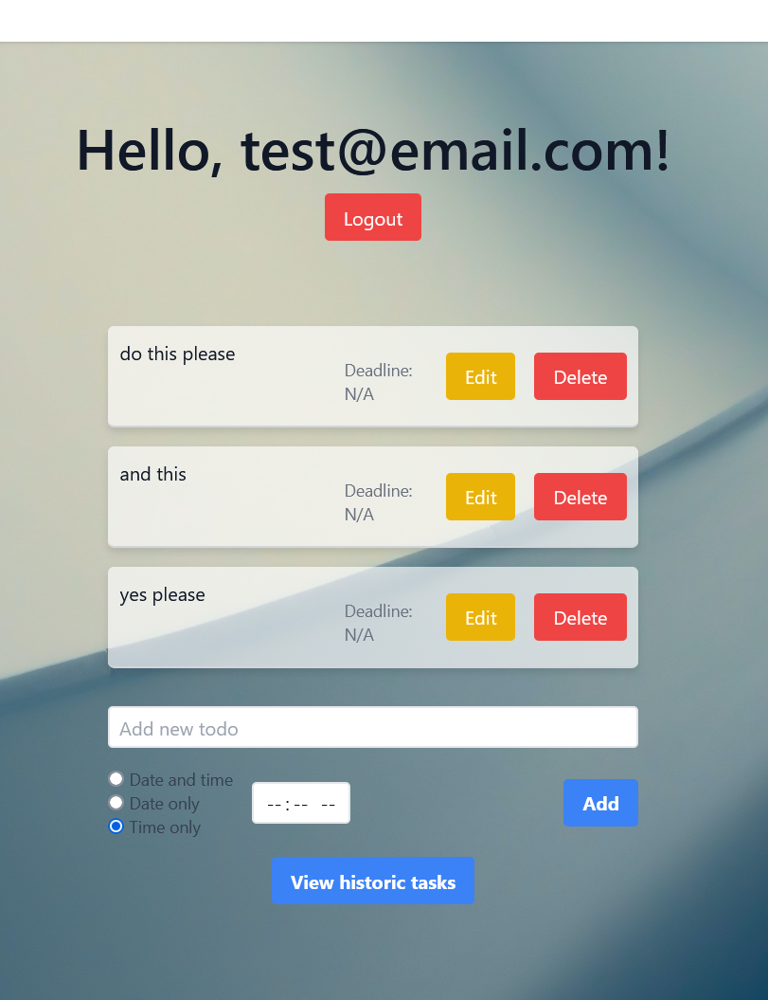

# Todolist - Next.js + Firebase project

This simple web application creates a responsive todo-list interface using Firebase as the database framework.
The user can insert and read their "todos" which include simple tasks for each user.
Allows registration via email etc...

The implementation uses Next.js to simplify the server-client interactions.

There's some fixes to do but I wanted to share it before I forget I made it again :)

This project was created by myself in an attempt to learn the basics of the Next.js framework.

Importantly, some of the code here is not 100% aligned with the full-stack mindset, as I focused on server-client MERN code only after finishing this project.

(made: June 2023)

The main part of the UI looks like this (screenshot):

